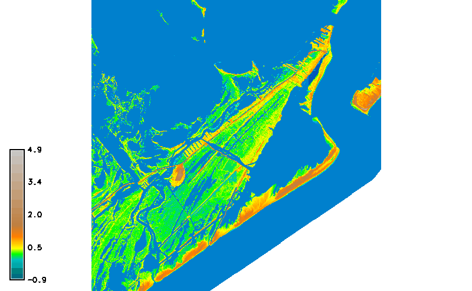

[](https://creativecommons.org/licenses/by/4.0/)

# Coastal studio
Online, open educational materials for a coastal landscape architecture studio.

<p align="center"></p>

**Resources** [Geospatial data sources](geospatial-data-sources.md)

**Software** | [GRASS GIS](https://grass.osgeo.org) |
[Rhino](https://www.rhino3d.com/) |

**Tutorials** | [Intro to GRASS GIS](http://ncsu-geoforall-lab.github.io/grass-intro-workshop/) | 
[lecture.lsu.edu/](https://lecture.lsu.edu/)

---
## Contents
1. [**Assignments**](#terrain-modeling)
    1. [**Site analysis**](#site-analysis)
        1. [**Site visit**](#site-visit)
        2. [**Research**](#research)
        3. [**Laser cut model**](#laser-cut-model)
        4. [**Geospatial analysis and mapping**](#geospatial-analysis-and-mapping)
        5. [**Sections**](#sections)
        6. [**Diagrams**](#diagrams)
    2. [**Site design**](#site-design)
2. [**Tutorials**](#tutorials)
    1. [**Terrain analysis**](#terrain-analysis)
    2. [**Hydrological modeling**](#hydrological-modeling)
---

# Assignments

## Site analysis

### Site visit
For our site visit to Elmer's Island on **10/02**
please bring a camera, your sketchbook,
and as a class a 32"x36" plot with contours
and another 32"x36" plot with orthoimagery.
Include a north arrow, scale, and cartographic grid on your plots.

### Research
Read the
[management plan](http://www.wlf.louisiana.gov/sites/default/files/pdf/refuge/32508-elmers-island-wildlife-refuge/elmers_island_management_plan_final.pdf)
and its [addendum](http://www.wlf.louisiana.gov/sites/default/files/pdf/refuge/32508-elmers-island-wildlife-refuge/draft_elmers_island_management_plan_addendum_031017.pdf).
As a class compile a list of plants, birds, and terrestrial and marine life
on Elmer's Island.
Then create a library of cutout *png* images
for at least 10 key species in each category.  
**Due: 10/06**
* Library of plants
* Library of birds
* Library of terrestrial and marine life

### Laser cut model
As a class build a laser cut contour model of Elmer's Island.
**Due: 10/13**
* Material: museum board (4-ply) or chipboard (1/16" thick)
* Contour interval: 0.25 m
* Tiles: grid of 6 square tiles

### Geospatial analysis and mapping
As groups of 2 compute geospatial analyses for our site.
Work through the
[terrain analysis](README.md#terrain-analysis)
and [hydrological modeling](README.md#hydrological-modeling)
tutorials.
Then design 3 *beautiful* maps
about topics like topography, vegetation, hydrology,
sea level rise, and flood risk.
Include cartographic elements like
legends, labels, scale bars, north arrows, and cartographic grids.
**Due: 10/13**
* 3 maps
* Layout and print all 3 maps on a 36"x72" plot
* Submit digital and print versions

### Sections
Each group will
draw at least 3 sections or section-elevations.
Make the section cuts in GRASS GIS or Rhino
Based on your site visit, the orthoimagery, and your research
illustrate your sections in Photoshop and/or Illustrator
to show plant, bird, and marine communities.
**Due: 10/18**
* 3+ illustrated section-elevations

### Diagrams
Each group will draw an environmental process diagram and a concept diagram.
The first diagram should illustrate how an environmental process
like dune morphology, coastal deposition and erosion,
land loss, or bird migration
functions on Elmer's Island.
The concept diagram should highlight
what aspect of the site interests you most,
explain why it's interesting,
and suggest a solution or intervention
laying the framework for your first design moves.
**Due: 10/18**
* Environmental process diagram
* Concept diagram

## Masterplanning
There will be a masterplanning charrette on **10/23**.
In the charrette each team will draw a masterplan
and a series of diagrams on trace.
Diagrams may include circulation, program, and site systems.
* Hand drawn masterplan
* Hand drawn diagrams

## Site design

### Concept model
Each group will build a physical conceptual model
that develops and explains their driving design idea.
For example this model may represent the structure of the boardwalk
and it's interface with the land and water,
it may show how new planting will shape the future evolution of the dunes,
or it may explore how the program will retreat with rising relative sea level.

### Site model

### Illustrative plan

### Sections

### Diagrams

### Planting plan
Each group will develop an illustrative planting plan
with a legend describing the plant selection.
Each group will also develop a phased scheme for planting over time,
which may be represented through sequential plans or axonometrics,
sequential sections, or a diagram.
**Due: 10/20**
* Illustrative planting plan
* Phased planting plan or diagram

## Final review
For the final review  on **11/30** curate a selection of your best work
representing your site analysis, masterplanning, and site design.
You must include a precedent study, a map, a masterplan, a site model,
a site plan, an illustrative planting plan, a phased planting plan,
2 sections, and 2 diagrams.

# Tutorials

## Terrain analysis
Start GRASS GIS in the `nad83_utm15n_barataria` location
and create a new mapset called `terrain_analysis`.

Set your region to our study area with 2 meter resolution
using the module
[g.region](https://grass.osgeo.org/grass72/manuals/g.region.html)
by specifying a reference raster map.
```
g.region raster=elmers_elevation_2m_2012 res=2
```
Or set your region by specifying its boundaries.
```
g.region n=3236000 s=3230000 e=788000 w=782000 res=2 save=elmers
```

### Contours
Compute contours from the digital elevation model using the module
[r.contour](https://grass.osgeo.org/grass72/manuals/r.contour.html)
with a 0.1 meter contour interval set with option `step=0.1`.
Then compute 1 meter contours using the option `step=1`.
```
r.contour input=elmers_elevation_2m_2012 output=contours_10cm step=0.1 minlevel=0
r.contour input=elmers_elevation_2m_2012 output=contours_1m step=1 minlevel=0
```

The contour map will be very noisy.
To reduce the noise,
first smooth the elevation map with
[r.neighbors](https://grass.osgeo.org/grass72/manuals/r.neighbors.html),
then rerun the contour command.
Test different `size` parameters for `r.neighbors`.
```
r.neighbors -c input=elmers_elevation_2m_2012 output=smoothed_elevation size=9
r.contour --overwrite input=smoothed_elevation output=contours_10cm step=0.1 minlevel=0
r.contour --overwrite input=smoothed_elevation output=contours_1m step=1 minlevel=0
```

Right click on the `contour_10cm` map layer and select `change opacity level`.
Set the opacity to 30%.

Right click on the `contour_1m` map layer and select `change opacity level`.
Set the opacity to 60%.
Double click on `contour_1m` in the layer manager,
switch to the line tab,
and make the line weight heavier (eg. 2 or 3 px).

### Hillshade
The typical way to visualize hillshading with shaded relief using the module
[r.relief](https://grass.osgeo.org/grass72/manuals/r.relief.html)
is not very effective for flat landscapes.
Instead use a sky-view factor visualization - a measure of
the openness of the landscape -
using the add-on module
[r.skyview](https://grass.osgeo.org/grass72/manuals/addons/r.skyview.html).
First call
[g.extension](https://grass.osgeo.org/grass72/manuals/g.extension.html)
to install the add-on.
The first time you run the add-on with the command `r.skyview`
you may need to include the flag
`--ui` to force the graphical user interface to launch.
With the color parameters you can create a colorized sky-view visualization
by draping another map (such as the elevation map) over the sky-view.
Optionally consider using the smoothed elevation as the input.
```
g.extension extension=r.skyview
r.skyview --overwrite input=elmers_elevation_2m_2012 output=skyview ndir=16 color_source=color_input color_input=elevation_2m_2012 colorized_output=colorized_skyview
```

### Slope
Compute the slope and aspect of our study area's topography
using the module
[r.slope.aspect](https://grass.osgeo.org/grass72/manuals/r.slope.aspect.html).
Optionally change the format from degrees to percent slope
with the parameter `format=percent`.
Also consider using the smoothed elevation as your input.
```
r.slope.aspect elevation=elmers_elevation_2m_2012 slope=elmers_slope
```

### Landforms
Identify the landforms in our study area using
a machine vision approach based on visibility
with the add-on module
[r.geomorphon](https://grass.osgeo.org/grass72/manuals/addons/r.geomorphon.html).
First call
[g.extension](https://grass.osgeo.org/grass72/manuals/g.extension.html)
to install the add-on.
Then run `r.geomorphon --ui` to compute basic landforms.
The flag `--ui` may be needed to force the graphic user interface for the
add-on to launch the first time.
The smoothed elevation will probably generate clearer, more legible results
than the source data elevation.
Experiment with the
`search`, `skip`, and `flat` parameters.
```
g.extension extension=r.geomorphon
r.geomorphon -m elevation=smoothed_elevation forms=landforms search=50 skip=0 flat=1 dist=0
```
The landform types are:
**1.** flat, **2.** summit, **3.** ridge, **4.** shoulder, **5.** spur,
**6.** slope, **7.** hollow, **8.** footslope, **9.** valley,
and **10.** depression.

<p align="center"></p>

## Visibility
Start GRASS GIS in the `nad83_utm15n_barataria` location
and create a new mapset called `viewsheds`.

Set your region to our study area with 2 meter resolution
using the module
[g.region](https://grass.osgeo.org/grass72/manuals/g.region.html)
by specifying a reference raster map.
```
g.region raster=elmers_elevation_2m_2012 res=2
```

### Viewshed analysis
Use the module
[r.viewshed](https://grass.osgeo.org/grass72/manuals/r.viewshed.html)
to compute a viewshed across the landscape.
The viewshed is what is visible for an observer in a given location.
Optionally change the height of the observer
with the parameter `observer_elevation` to test views from a new structure like
an observation tower, bird hide, boardwalk, or visitor center.
Again consider using the smoothed elevation as your input.
Experiment with the flags `-b` or `e` for different output formats.
```
r.viewshed input=elmers_elevation_2m_2012 output=viewshed coordinates=785051.917331,3232032.61952 observer_elevation=1.75
```

### Cumulative viewshed analysis
Use the add-on module
[r.viewshed.cva](https://grass.osgeo.org/grass72/manuals/addons/r.viewshed.cva.html)
to compute the cumulative viewshed for multiple locations.
Create a new vector map called `observers`.
Use the vector digitizer

to create observer points.
With the vector digitizer
use the `digitize new point` command to create new points
then quit the digitizer and save your changes.
Use [g.extension](https://grass.osgeo.org/grass72/manuals/g.extension.html)
to install the add-on.
Then run `r.viewshed.cva --ui` to run the add-on module.
The flag `--ui` may be needed to force the graphic user interface for the
add-on to launch the first time.
Use the new vector point map `observers` as your input vector map.
Optionally change the height of the observers
with the parameter `observer_elevation` to test views from new structures.
Experiment with the flags `-b` or `e` for different output formats.
```
g.extension extension=r.viewshed.cva
r.viewshed.cva input=elmers_elevation_2m_2012 vector=observers output=cumulative_viewsheds
```

## Hydrological modeling
Start GRASS GIS in the `nad83_utm15n_barataria` location
and create a new mapset called `hydrology`.

Set your region to our study area with 2 meter resolution
using the module
[g.region](https://grass.osgeo.org/grass72/manuals/g.region.html)
by specifying a reference raster map.
```
g.region raster=elmers_elevation_2m_2012 res=2
```

### Inundation modeling
Model current sea level using the module
[r.lake](https://grass.osgeo.org/grass72/manuals/r.lake.html).
Set the water level to 0 meter, i.e. sea level.
In the seed tab use the 
to pick coordinates somewhere out in the ocean on the map display
for the starting point.
```
r.lake elevation=elmers_elevation_2m_2012@PERMANENT water_level=0 lake=sea_level
```
In the layer manager move the sea level map
above the elevation and contour maps.

### Flow accumulation
Model flow accumulation for our study area using the module
[r.watershed](https://grass.osgeo.org/grass72/manuals/r.watershed.html).
```
r.watershed -a elevation=elmers_elevation_2m_2012@PERMANENT accumulation=flow_accumulation
```

Use map algebra with the GRASS GIS Raster Map Calculator
[r.mapcalc](https://grass.osgeo.org/grass72/manuals/r.mapcalc.html)
to remove cells beneath sea level.
```
r.mapcalc "accumulation = if(isnull(sea_level@PERMANENT),flow_accumulation@hydrology,null())"
```
This expression means
if there are cells where the sea level map is null (ie. has no value),
then write the flow accumulation values,
else write null values.


Copy the color table from the `flow accumulation` map using
[r.colors](https://grass.osgeo.org/grass72/manuals/r.colors.html)
```
r.colors map=accumulation@hydrology raster=flow_accumulation@hydrology
```

To see only the concentrated flow accumulation
hide the cells with values less than `60`
by either
double clicking on the `accumulation` map in the layer manager
and setting the list of values to display to `60-58849.4460216767`
or running the command:
```
d.rast map=accumulation@hydrology values=60-58849.4460216767
```
Experiment to find the right minimum value.

In the layer manager move the `accumulation` map layer
above the `elmers_elevation_2m_2012` and `sea_level` map layers.

Display the flow accumulation legend
by either pressing the

`Add raster legend` button
or running the command
[d.legend](https://grass.osgeo.org/grass72/manuals/d.legend.html).
Use the `-n` flag to hide categories
that are not represented in the data.

### Sea level rise animation
Install the `r.lake.series` add-on with
[g.extension](https://grass.osgeo.org/grass72/manuals/g.extension.html).
```
g.extension extension=r.lake.series
```

Model sea level rise over time using the add-on module
[r.lake.series](https://grass.osgeo.org/grass72/manuals/addons/r.lake.series.html).
In the water tab
set the starting water level to 0 m, the end water level to 2 m,
and the water level step to 0.1 m.
Use the 
to pick coordinates somewhere out in the ocean on the map display
for the starting point.
In the time tab set the time step to 5 years
to model sea level rise over 100 years.
This module will create a time series of raster maps
named `sea_level_rise_0.0`, `sea_level_rise_0.1`, `sea_level_rise_0.2`, etc...
that will all be registered in a space time raster dataset.
```
r.lake.series elevation=elmers_elevation_2m_2012@PERMANENT output=sea_level_rise start_water_level=0 end_water_level=2 water_level_step=0.1 coordinates=787832.669323,3232533.86454 time_step=5 time_unit=years
```

To animate this sea level rise time series launch the GRASS Animation Tool
[g.gui.animation](https://grass.osgeo.org/grass72/manuals/g.gui.animation.html).
If you launch the Animation Tool from the File menu in the GUI
follow the these instructions.
Create a new animation,
add a space-time dataset layer,
choose `space time raster dataset` as the input data type,
and choose the `sea_level_rise` space time raster dataset.
Then add a raster map layer
and choose `elmers_elevation_2m_2012@PERMANENT`.
Move this raster map layer beneath the space time raster dataset.
Check the `Show raster legend` button
and choose `elmers_elevation_2m_2012@PERMANENT`
as the raster map in the d.legend dialog.
Press `Ok` to create to the animation.
Press `Play` to run the animation.
Export your animation as an animated gif.
Press the `Export` button,
select export to `animated GIF`,
then browse and name your file,
and press `Export`.
```
g.gui.animation strds=sea_level_rise
```


# Submission
Upload digital copies of your work to the class network drive
at `\\desn-knox.lsu.edu\Landscape-Classes` on Windows
or `smb://desn-knox.lsu.edu/Landscape-Classes` on Mac.

# License
CC BY-SA 4.0 by Brendan Harmon. The license does not apply to logos, fonts, linked material, quotations, or reprinted images by other authors, which may have different licenses. The fonts used in this repository are licensed under the SIL Open Font License by their authors. The syllabus is based on a latex template by Kieran Healy hosted at https://github.com/kjhealy/latex-custom-kjh.
